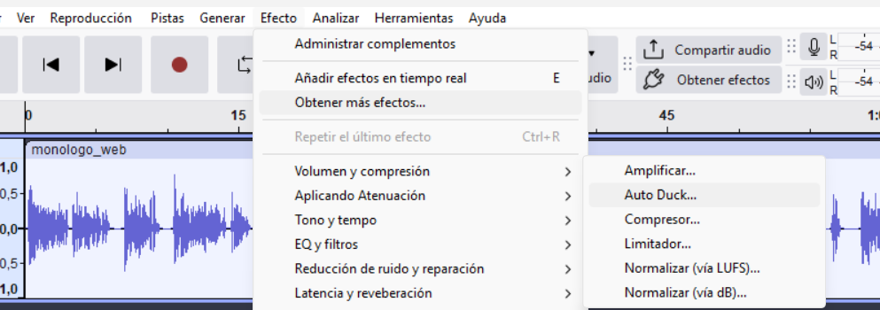
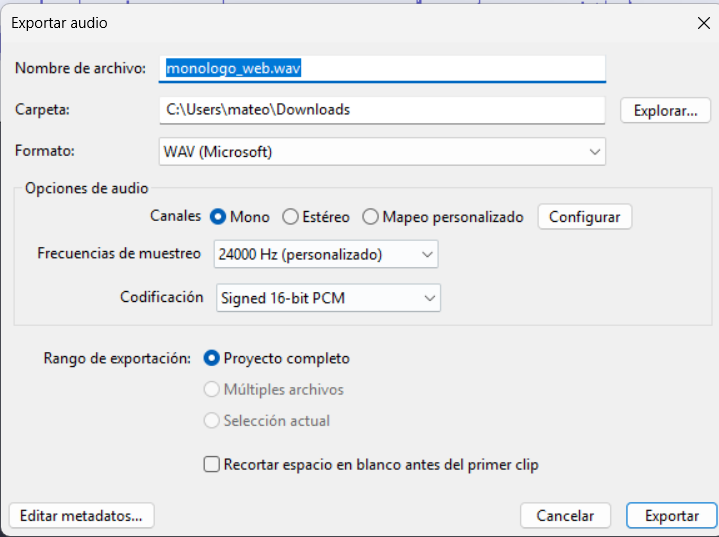

# 🎧 ShockWave: Web para Podcasts

Este proyecto es una plataforma interactiva para la producción y distribución de podcasts, integrando producción multimedia avanzada, inteligencia artificial y desarrollo web de alto rendimiento.

## 🛠️ Herramientas y Tecnologías

Para la realización de este proyecto se han utilizado las siguientes herramientas profesionales:
* **Desarrollo:** React (Vite), Tailwind CSS v4.0 y GSAP para animaciones.
* **Audio:** **Audacity** para la edición y mezcla multipista.
* **Vídeo:** **Veo** (Google Gemini) para la generación de clips cinemáticos y **Canva** para el montaje final.
* **Recursos:** **Pixabay** para música de fondo y efectos sonoros libres de derechos.
* **IA:** Clonación de voz para la narrativa del podcast ("Mateo") con luvvoice.

---

## 1. Producción Multimedia

### 🎙️ Podcast: "Zombie Internet"
* **Edición:** Grabado y editado íntegramente en **Audacity**. Se aplicó **reducción de ruido** para limpiar la voz sintética y el efecto **Auto Duck** para equilibrar la música de fondo de **Pixabay** con la locución de forma automática.
* **Optimización:** El archivo final se exportó en **wav**, garantizando un audio nítido con un peso optimizado para la web.
* **Estructura de Datos:** La transcripción no es texto plano estático; se gestiona mediante un archivo `transcripcion_ep1.js` que contiene un objeto estructurado con tiempos y secciones, permitiendo un renderizado dinámico en React.

### 📹 Vídeo Promocional
* **Generación:** Los visuales fueron generados mediante **Veo**, creando una atmósfera *Digital Noir* coherente con el tema.
* **Montaje:** Se utilizó **Canva** para la composición de clips, superposición de textos y sincronización con el audio promocional.
* **Formato:** Exportado en **MP4 (H.264)** con una pista de subtítulos integrada mediante un archivo **WebVTT (.vtt)** para asegurar la accesibilidad total.

---

## 2. Proceso de Edición en Audacity
Como parte de los requisitos técnicos, se documenta el proceso de post-producción de audio:

> **[Aquí debes insertar tus capturas de pantalla de Audacity]**
> * *Captura 1: Vista de las pistas de voz y música superpuestas.*

> * *Captura 2: Aplicación del efecto Auto Duck en la pista de fondo.*

> * *Captura 3: Configuración de la exportación a WAV.*

---

## 3. Desarrollo Web y Accesibilidad (WCAG AA)

* **Arquitectura:** Organización basada en componentes funcionales de React para una navegación SPA (*Single Page Application*) fluida.
* **Animaciones:** Uso de **GSAP** para crear una experiencia inmersiva desde la carga inicial de la página.
* **Accesibilidad:**
    * **Estructura Semántica:** Uso estricto de etiquetas HTML5 (`<header>`, `<main>`, `<section>`).
    * **Navegación:** Interfaz 100% navegable por teclado con indicadores de foco visibles.
    * **Contenido:** Transcripción completa accesible desde la interfaz y subtítulos sincronizados en el reproductor de vídeo.
    * **Validación:** Verificado con **Lighthouse** y **WAVE** para asegurar ratios de contraste y etiquetas `aria-label` correctas.

---

## 4. Licencia y Atribución

Este proyecto se distribuye bajo la licencia **Creative Commons (CC BY-NC-SA 4.0)**. 
* **Código y Diseño:** Mateo.
* **Música:** Pixabay (Licencia de contenido gratuito).
* **Visuales:** Generados por IA (Veo).

---